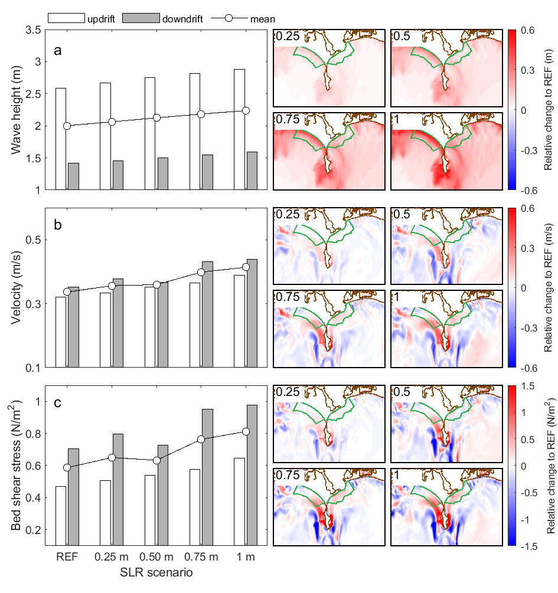
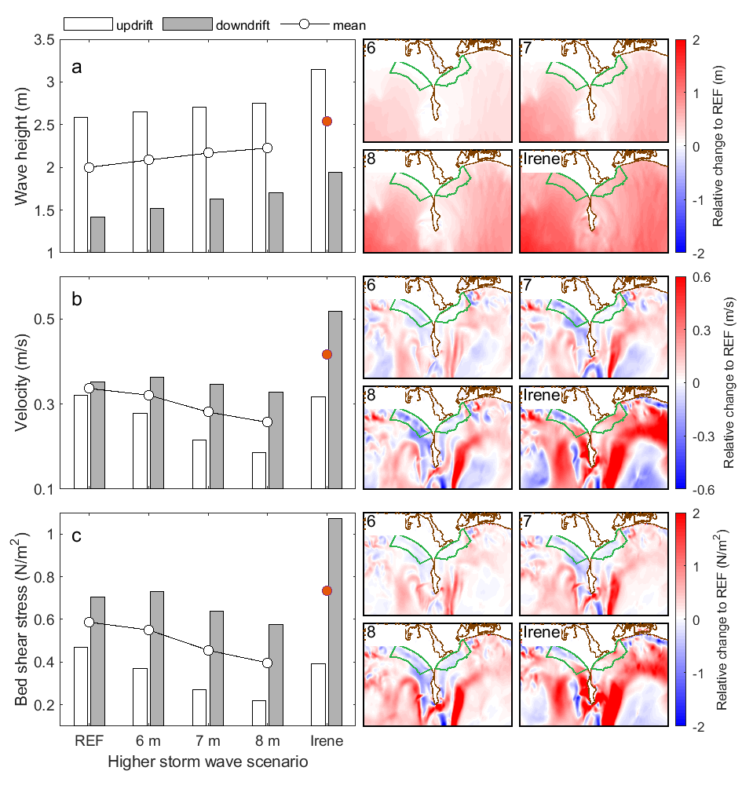
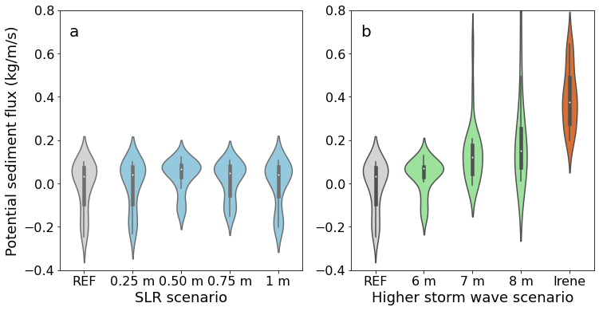

# Coastal Circulation Cells Around Headland

*Coastal Circulation Cells Around Headland* is a numerical modelling study investigating the impacts of a coastal headland on nearshore hydrodynamics. Here, a basic set-up of this modelling research is introduced. More detailed results regarding this research can be freely accssed through the link: https://doi.org/10.1029/2023GL105323.

## Highlights
###### 1. The Formation of Circulation Cells and Wave Energy Convergence Around Headlands During Storms Reduce Bottom Shear Stress at the Beach

    

    Figure 1. Model regions in the study area (Western Buzzards Bay, MA, USA), boundary conditions and key hydrodynamic parameters around the headland during the present-day storm conditions. 

 

###### 2. Sea-Level Rise Increases Wave Heights, Currents, and Bed Shear Stress in the Nearshore Because of Landward Shifting of the Circulation Cells

    

    Figure 2. Changes in Wave Height, Velocity, and Bed Shear Stress Under Different Sea-Level Rise Scenarios. 

 

###### 3. Higher Storm Waves Expand the Surf Zone, Shift Circulation Cells Seaward

    

    Figure 3. Changes in Wave Height, Velocity, and Bed Shear Stress Under Different Scenarios of Storm Waves. 

 

###### 4. Higher Storm Waves Enhance Potential Headland Sediment Bypassing

    

    Figure 4. Potential Sediment Flux Along the Transect in Front of the Headland Under Different SLR Scenarios (a) and Higher Storm Wave Scenarios (b). 

 

###### 5. Increase in Velocity or Bed Shear Stress due to SLR is Balanced By Increasing Wave Height, leading to minimal changes in these two variables under certain combinations. Hence, the Combinations of SLR and Wave Height are of Critical Importance in Determining Hydrodynamic Changes Along the Beach in the Future

    

    Figure S6. Relative Changes in Velocity (a) and Bed Shear Stress (b) at the Beach Regions. 

 

## Contacts
For any potential questions or suggestions, please contact me through the email (danghan@bu.edu).

Sincerely, 
Danghan Xie 
6th July., 2023 
